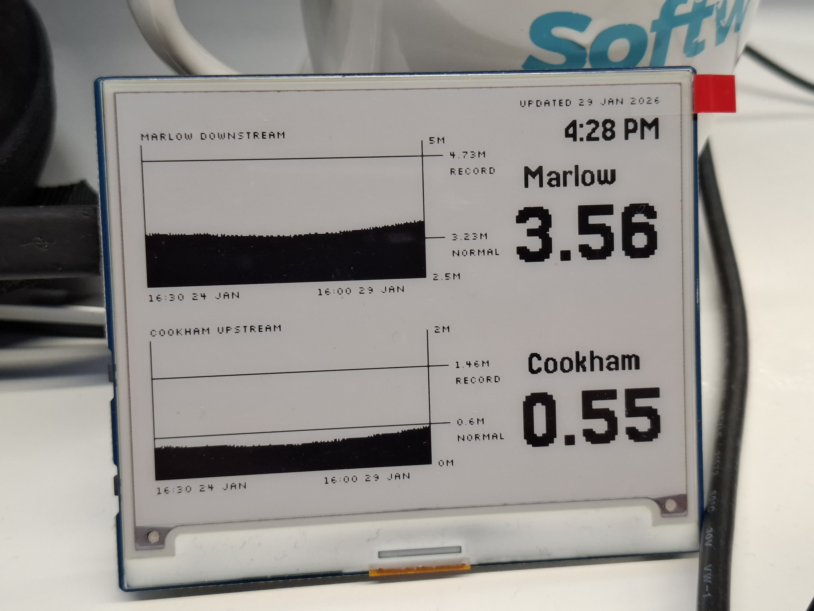

# Python Flood Monitor

PythonFloodMonitor fetches UK Environment Agency river level data, renders it into an e-ink-friendly format, publishes it to S3, and displays it on a Waveshare 4.2" e-ink panel driven by a Raspberry Pi Pico W.

## This was a fun learning project

I've had this project on a back burner for a couple of years, never quite getting it to work. I don't really know python very well, the Pico would keep running out of memory, and then Summer would come and the flood risk passes - so I would lose interest.

Two key changes finally got me over the line to a vaguely working project. A colleage advised me to do all the heavy lifting and data processing in an AWS lambda - and keep the pico code to the bare-minimum, just rendering an image to the display.
The other key change was that I needed a learning project to play with AI code. So this version of the project was built from scratch using Windsurf. I'm not sure which models (they keep changing) but most recently GPT-5.2 and claude Sonnet 4.5.

### Here be Dragons

I don't know Terraform - and while I'm relatively confident, there is a risk that this code could do bad, and expensive, things in your AWS account. Proceed at your own risk. (If you know what you're doing and have feedback about anything stupid and/or dangerous I've done - please let me know or submit a PR).

### Play along at home
If you'd like to make one at home, the two displays I've tested this with are the waveshare 4.2" e-ink. In the UK, you can get them from The Pi Hut - but they're probably also available from ebay, Amazon marketplace etc: 

[The Pi Hut - 4.2" ePaper Display Module for Raspberry Pi Pico - Black/White](https://thepihut.com/products/4-2-e-paper-display-module-for-raspberry-pi-pico-black-white-400x300).

[The Pi Hut - 4.2" ePaper Display Module for Raspberry Pi Pico - Red/Black/White](https://thepihut.com/products/4-2-e-paper-display-module-for-raspberry-pi-pico-red-black-white-400x300?variant=40874935222467).

You'll also need a Raspberry Pi Pico WH (the one with Wifi, and header-pins soldered on).

If you know what you are doing, you could probably adapt this code quite easily to work with any display that uses a Micropython framebuffer.

## How it works

This repo has two main components:

- **Fletcher** (Flood Data Fetcher)
  - AWS Lambda that fetches river level data and processes it in a few ways:
    - Resamples about 420 datapoints into exactly 200 using the excellently names "Three buckets largest triangle" algorithm.
    - Aggregates all of the relevant data into a JSON file.
    - Renders an image for that data as a black and white (no grey) png, and a black red and white png.
    - Renders a binary byte array for that data, both 2-colour (black/white) and 3-colour (black/white/red), which is simple to blit straight to the e-ink display later (ie a Micropython framebuffer).
    - All of these are published to S3.

  - Runs on a 15-minute schedule in AWS (EventBridge).

- **Pinky** (Pico E-Ink Display)
  - MicroPython app for Raspberry Pi Pico W + Waveshare 4.2" e-ink.
  - Fetches the framebuffer binary from the public URL and displays it.
  - Supports:
    - 2-colour (black/white)
    - 3-colour (black/white/red)
  - Optional scheduled update loop (checks every 5 minutes with HTTP HEAD; downloads only when changed).

## Repository layout

- `Plan.md`
  - Project-level overview and working approach.
- `Fletcher/`
  - Lambda code and local generation scripts.
- `Fletcher/infra/`
  - Terraform for deploying the Lambda, IAM, schedule, and supporting infra.
- `Pinky/`
  - MicroPython code for the Pico W + display.

## Quick start

### A) Fletcher (AWS Lambda)

Start here:
- `Fletcher/infra/infra.md`

You will typically copy/edit these templates:
- `Fletcher/infra/prod.tfvars.example`
  - Copy to `Fletcher/infra/prod.tfvars` and set:
    - `aws_region`
    - `bucket_name` (existing bucket)
    - `bucket_key_prefix` (optional)
    - `lambda_function_name`
- `Fletcher/infra/backend-prod.hcl.example`
  - Copy to `Fletcher/infra/backend-prod.hcl` (Terraform remote state config)

Common commands (exact commands documented in `infra.md`):
- `terraform init -reconfigure -backend-config=backend-prod.hcl`
- `terraform plan -var-file=prod.tfvars -out=prod.tfplan`
- `terraform apply prod.tfplan`
- `aws lambda invoke --region eu-west-1 --function-name fletcher-walking-skeleton-prod out.json`

### B) Pinky (Raspberry Pi Pico W)

Start here:
- `Pinky/Pinky-Plan.md`

You will typically copy/edit these templates:
- `Pinky/secrets.py.example`
  - Copy to `Pinky/secrets.py` and set:
    - `WIFI_SSID`
    - `WIFI_PASSWORD`
- `Pinky/config.py.example`
  - Copy to `Pinky/config.py` and set URLs/mode options.

Key Pinky settings (in `Pinky/config.py`):
- `FRAMEBUFFER_SOURCE`
  - `"local"` for local file testing
  - `"wifi"` to fetch from Fletcher
- `SCHEDULED_MODE` / `SCHEDULE_CHECK_INTERVAL_S`
  - Enable periodic checks and how often to check
- `USE_3COLOR`
  - `True` for a 3-colour (B/W/Red) display (fetches `latest_3c.bin`)
  - `False` for a 2-colour (B/W) display (fetches `latest.bin`)

## Reference docs

- `Plan.md`
- `Fletcher/Fletcher-Plan.md`
- `Fletcher/infra/infra.md`
- `Pinky/Pinky-Plan.md`

## Copyright and license

Copyright (c) Jan 2026 Andrew Maddison.

Licensed under the Apache License, Version 2.0 (the "License");
  you may not use this file except in compliance with the License.
  You may obtain a copy of the License at

      http://www.apache.org/licenses/LICENSE-2.0

  Unless required by applicable law or agreed to in writing, software
  distributed under the License is distributed on an "AS IS" BASIS,
  WITHOUT WARRANTIES OR CONDITIONS OF ANY KIND, either express or implied.
  See the License for the specific language governing permissions and
  limitations under the License.

See [`LICENSE.md`](LICENSE.md).
